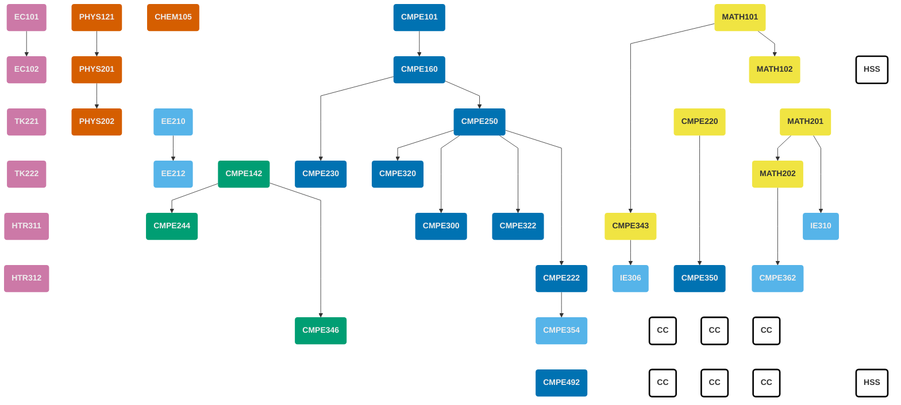


This page is part of the **[Transition Plan](/undergraduate/transition-plan/)** for the curriculum change.  
Students who enrolled in the department **before Fall 2025** should follow [the Old Curriculum](/undergraduate/curriculum), while those who enrolled in **Fall 2025 or later** should follow [the New Curriculum](/undergraduate/curriculum-new).

For detailed semester-by-semester information, see the **[Transition Plan (Fall 2025–Spring 2029)](/undergraduate/transition-plan/)**.


<!-- prettier-ignore-start -->

||
|:-- |:----------- |:-:|:---:|
| <h4>First Semester</h4>|
| **Code** | **Course Title** | **Prerequisites** | **Credits** | **ECTS** |
| [CMPE101](/courses/cmpe101) | Introduction to Computer Engineering | --- | 4 | 6 |
| MATH101 | Calculus I | --- | 4 | 6 |
| PHYS121 | Introductory Mechanics & Thermodynamics | --- | 4 | 6 |
| CHEM105 | Fundamentals of Chemistry | --- | 4 | 6 |
| EC101 | Principles of Microeconomics | --- | 3 | 6 |
| | | **Total** | **19** | **30** |
| <h4>Second Semester</h4>|
| **Code** | **Course Title** | **Prerequisites** | **Credits** | **ECTS** |
| [CMPE142](/courses/cmpe142) | Digital Systems | --- | 4 | 6 |
| [CMPE160](/courses/cmpe160) | Object Oriented Programming | CMPE101 | 4 | 8 |
| PHYS201 | Physics III | PHYS121 | 4 | 6 |
| MATH102 | Calculus II | MATH101 | 4 | 6 |
| EC102 | Principles of Macroeconomics | EC101 | 3 | 6 |
| | | **Total** | **19** | **32** |
| <h4>Third Semester</h4>|
| **Code** | **Course Title** | **Prerequisites** | **Credits** | **ECTS** |
| [CMPE220](/courses/cmpe220) | Discrete Computational Structures | --- | 3 | 5 |
| [CMPE230](/courses/cmpe230) | System Programming | CMPE160 | 3 | 6 |
| [CMPE250](/courses/cmpe250) | Data Structures and Algorithms | CMPE160 | 3 | 6 |
| MATH201 | Matrix Theory | --- | 4 | 5 |
| EE210 | Introduction to Electrical Engineering | --- | 3 | 6 |
| TK221 | Turkish Language and Literature I | --- | 2 | 3 |
| | | **Total** | **18** | **31** |
| <h4>Fourth Semester</h4>|
| **Code** | **Course Title** | **Prerequisites** | **Credits** | **ECTS** |
| [CMPE222](/courses/cmpe222) | Introduction to Database Systems | CMPE250 | 3 | 6 |
| [CMPE244](/courses/cmpe244) | Computer Organization | CMPE142 | 4 | 5 |
| MATH202 | Differential Equations | MATH201 | 4 | 7 |
| PHYS202 / Sci. El. | Physics IV / Science Elective (*) | PHYS201 (for PHYS202) | 3 | 6 |
| EE212 | Introduction to Electronic Engineering | EE210 | 3 | 4 |
| TK222 | Turkish Language and Literature II | --- | 2 | 3 |
| | | **Total** | **19** | **31** |
| <h4>Fifth Semester</h4>|
| **Code** | **Course Title** | **Prerequisites** | **Credits** | **ECTS** |
| [CMPE300](/courses/cmpe300) | Analysis of Algorithms | CMPE250 | 3 | 5 |
| [CMPE322](/courses/cmpe322) | Operating Systems | CMPE250 | 3 | 6 |
| [CMPE343](/courses/cmpe343) | Intro. to Probability and Statistics for Comp. Eng. | MATH101 | 3 | 6 |
| [CMPE346](/courses/cmpe346) | Principles of Embedded Systems Design | CMPE142 | 4 | 6 |
| IE310 | Operations Research | MATH201 | 4 | 5 |
| HTR311 | History of Turkish Republic I | --- | 2 | 3 |
| | | **Total** | **19** | **31** |
| <h4>Sixth Semester</h4>|
| **Code** | **Course Title** | **Prerequisites** | **Credits** | **ECTS** |
| [CMPE320](/courses/cmpe320) | Principles of Programming Languages | CMPE250 | 3 | 5 |
| [CMPE350](/courses/cmpe350) | Formal Languages and Automata Theory | CMPE220 | 3 | 5 |
| [CMPE354](/courses/cmpe354) | Software Engineering | CMPE222 | 4 | 4 |
| [CMPE362](/courses/cmpe362) | Introduction to Signal Processing for Comp. Eng. | MATH202 | 3 | 6 |
| IE306 | System Simulation | CMPE343 | 4 | 7 |
| HTR312 | History of Turkish Republic II | ---  | 2 | 3 |
| | | **Total** | **19** | **30** |
| <h4>Seventh Semester</h4>|
| **Code** | **Course Title** | **Prerequisites** | **Credits** | **ECTS** |
| Specified Elective (***) | Free Elective (Department-Restricted) | --- | 3 | 5 |
| HUM101 / HSS | Cultural Encounters I / HSS (**) | --- | 4 | 6 |
| CMPE xxx | Departmental Elective | see course | 3 | 6 |
| CMPE xxx | Departmental Elective | see course | 3 | 6 |
| CC | Complementary Course (Elective) | see course | 3 | 6 |
| | | **Total** | **16** | **29** |
| <h4>Eighth Semester</h4>|
| **Code** | **Course Title** | **Prerequisites** | **Credits** | **ECTS** |
| [CMPE492](/courses/cmpe492) | Computer Engineering Design Project | SENIOR | 4 | 8 |
| CMPE xxx | Departmental Elective | see course | 3 | 6 |
| CC | Complementary Course (Elective) | see course | 3 | 6 |
| CC  | Complementary Course (Elective)| see course | 3 | 6 |
| HUM102 / HSS | Cultural Encounters II / HSS (**) | --- | 3 | 5 |
| CMPE400| Engineering Internship | departmental rules | 0 | 10 |
| | | **Total** | **16** | **41** |

<!-- prettier-ignore-end -->

(\*) **Science Elective** is a basic science course in Physics, Chemistry, Biology or Mathematics (non-computational).  

(\**) **HUM101–HUM102–HSS** can be taken interchangeably and repeated with each other.  

(\***) **Specified Elective** is a free elective restricted by the CmpE Department; it may overlap with other lists.  

\(****) **Complementary Courses** can be selected from the Departmental Elective list.

## Prerequisites Graph

## Committee


