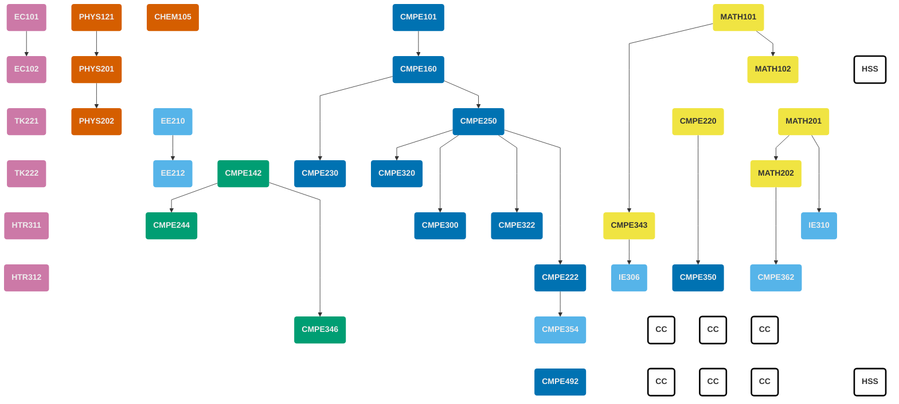


Bu sayfa, **[Geçiş Planı](/undergraduate/transition-plan/)** kapsamında geçerli olan müfredatlardan biridir.  
Öğrenciler, bölüme **Güz 2025 öncesinde** kayıt olmuşlarsa [Eski Müfredat](/undergraduate/curriculum), **Güz 2025 ve sonrasında** kayıt olmuşlarsa [Yeni Müfredat](/undergraduate/curriculum-new) kapsamındaki dersleri takip etmelidir.

Ayrıntılı dönem bazlı bilgiler için: **[Geçiş Planı (Güz 2025 – Bahar 2029)](/undergraduate/transition-plan/)**.


<!-- prettier-ignore-start -->

||
|:-- |:----------- |:-:|:---:|
| <h4>Birinci Dönem</h4>|
| **Ders Kodu** |**Ders Başlığı** | **Önkoşullar** | **Kredi** | **AKTS** |
| [CMPE101](/tr/courses/cmpe101) | Bilgisayar Mühendisliğine Giriş | --- | 4 | 6 |
| MATH101 | Analiz I | --- | 4 | 6 |
| PHYS121 | Mekanik ve Termodinamiğe Giriş | --- | 4 | 6 |
| CHEM105 | Kimyanın Temelleri | --- | 4 | 6 |
| EC101 | Mikroekonominin İlkeleri | --- | 3 | 6 |
| | | **Toplam** | **19** | **30** |
| <h4>İkinci Dönem</h4>|
| **Ders Kodu** |**Ders Başlığı** | **Önkoşullar** | **Kredi** | **AKTS** |
| [CMPE142](/tr/courses/cmpe142) | Dijital Sistemler | --- | 4 | 6 |
| [CMPE160](/tr/courses/cmpe160) | Nesne Tabanlı Programlamaya Giriş | CMPE101 | 4 | 8 |
| PHYS201 | Fizik III | PHYS121 | 4 | 6 |
| MATH102 | Analiz II | MATH101 | 4 | 6 |
| EC102 | Makroekonominin İlkeleri | EC101 | 3 | 6 |
| | | **Toplam** | **19** | **32** |
| <h4>Üçüncü Dönem</h4>|
| **Ders Kodu** |**Ders Başlığı** | **Önkoşullar** | **Kredi** | **AKTS** |
| [CMPE220](/tr/courses/cmpe220) | Kesikli Hesaplama Yapıları | --- | 3 | 5 |
| [CMPE230](/tr/courses/cmpe230) | Sistem Programlama | CMPE160 | 3 | 6 |
| [CMPE250](/tr/courses/cmpe250) | Veri Yapıları ve Yordamlar | CMPE160 | 3 | 6 |
| MATH201 | Matris Kuramı | --- | 4 | 5 |
| EE210 | Elektrik Mühendisliğine Giriş | --- | 3 | 6 |
| TK221 | Türkçe I | --- | 2 | 3 |
| | | **Toplam** | **18** | **31** |
| <h4>Dördüncü Dönem</h4>|
| **Ders Kodu** |**Ders Başlığı** | **Önkoşullar** | **Kredi** | **AKTS** |
| [CMPE222](/tr/courses/cmpe222) | Veri Tabanı Sistemlerine Giriş | CMPE250 | 3 | 6 |
| [CMPE244](/tr/courses/cmpe244) | Bilgisayar Organizasyonu | CMPE142 | 4 | 5 |
| MATH202 | Türevsel Denklemler | MATH201 | 4 | 7 |
| PHYS202 / Bilim Seçmeli | Fizik IV / Bilim Seçmeli (*) | PHYS201 (PHYS202 için) | 3 | 6 |
| EE212 | Elektronik Mühendisliğine Giriş | EE210 | 3 | 4 |
| TK222 | Türkçe II | --- | 2 | 3 |
| | | **Toplam** | **19** | **31** |
| <h4>Beşinci Dönem</h4>|
| **Ders Kodu** |**Ders Başlığı** | **Önkoşullar** | **Kredi** | **AKTS** |
| [CMPE300](/tr/courses/cmpe300) | Algoritma Analizi | CMPE250 | 3 | 5 |
| [CMPE322](/tr/courses/cmpe322) | İşletim Sistemleri | CMPE250 | 3 | 6 |
| [CMPE343](/tr/courses/cmpe343) | Bilgisayar Mühendisleri için Olasılık ve İstatistiğe Giriş | MATH101 | 3 | 6 |
| [CMPE346](/tr/courses/cmpe346) | Gömülü Sistemler Prensipleri | CMPE142 | 4 | 6 |
| IE310 | Yöneylem Araştırması | MATH201 | 4 | 5 |
| HTR311 | Türkiye Cumhuriyeti Tarihi I | --- | 2 | 3 |
| | | **Toplam** | **19** | **31** |
| <h4>Altıncı Dönem</h4>|
| **Ders Kodu** |**Ders Başlığı** | **Önkoşullar** | **Kredi** | **AKTS** |
| [CMPE320](/tr/courses/cmpe320) | Programlama Dillerinin Prensipleri | CMPE250 | 3 | 5 |
| [CMPE350](/tr/courses/cmpe350) | Biçimsel Diller ve Makineler Kuramı | CMPE220 | 3 | 5 |
| [CMPE354](/tr/courses/cmpe354) | Yazılım Mühendisliği | CMPE222 | 4 | 4 |
| [CMPE362](/tr/courses/cmpe362) | Bilgisayar Mühendisleri için Sinyal İşleme | MATH202 | 3 | 6 |
| IE306 | Sistem Benzetimi | CMPE343 | 4 | 7 |
| HTR312 | Türkiye Cumhuriyeti Tarihi II | --- | 2 | 3 |
| | | **Toplam** | **19** | **30** |
| <h4>Yedinci Dönem</h4>|
| **Ders Kodu** |**Ders Başlığı** | **Önkoşullar** | **Kredi** | **AKTS** |
| Belirtilmiş Serbest Seçmeli (***) | Bölüm-Kısıtlı Serbest Seçmeli | --- | 3 | 5 |
| HUM101 / HSS | Kültürel Karşılaşmalar I / HSS (**) | --- | 4 | 6 |
| CMPE xxx | Bölüm Seçmeli | ilgili ders | 3 | 6 |
| CMPE xxx | Bölüm Seçmeli | ilgili ders | 3 | 6 |
| CC| Tamamlayıcı Ders (Seçmeli) | ilgili ders | 3 | 6 |
| | | **Toplam** | **16** | **29** |
| <h4>Sekizinci Dönem</h4>|
| **Ders Kodu** |**Ders Başlığı** | **Önkoşullar** | **Kredi** | **AKTS** |
| [CMPE492](/tr/courses/cmpe492) | Bilgisayar Mühendisliği Tasarım Projesi | SENIOR | 4 | 8 |
| CMPE xxx | Bölüm Seçmeli | ilgili ders | 3 | 6 |
| CC | Tamamlayıcı Ders (Seçmeli) | ilgili ders | 3 | 6 |
| CC | Tamamlayıcı Ders (Seçmeli) | ilgili ders | 3 | 6 |
| HUM102 / HSS | Kültürel Karşılaşmalar II / HSS (**) | --- | 3 | 5 |
| CMPE400 | Mühendislik Stajı | bölüm kuralları | 0 | 10 |
| | | **Toplam** | **16** | **41** |

<!-- prettier-ignore-end -->

(\*)  **Bilim Seçmeli Dersi**, Fizik, Kimya, Biyoloji veya Matematik (hesaplamalı olmayan) alanlarında temel bir bilim dersidir.

(\**) HUM101–HUM102–HSS dersleri birbirlerinin yerine alınabilir ve birbirleriyle tekrarlanabilir.

(\***)  **Belirlenmiş Seçmeli**, CmpE Bölümü tarafından sınırlandırılmış serbest bir seçmelidir; diğer listelerle örtüşebilir.

(\****)  **Tamamlayıcı Dersler**, Bölüm Seçmeli listesi içinden seçilebilir.

## Önkoşul Çizgesi

## Komisyon Üyeleri


