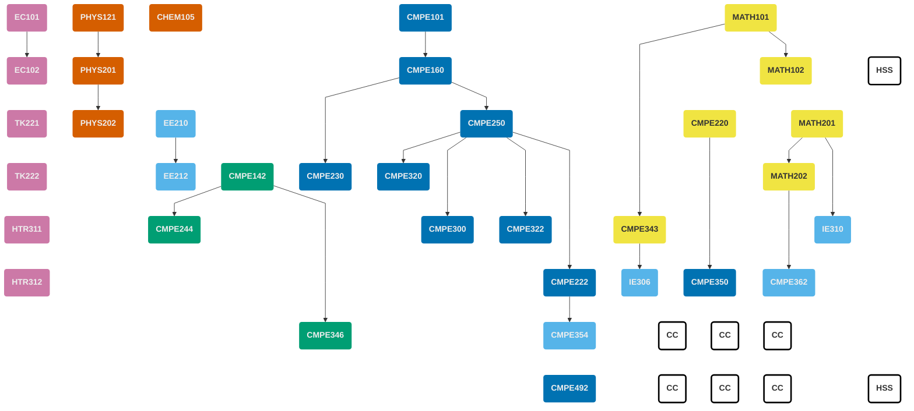

<!-- prettier-ignore-start -->

||
|:-- |:----------- |:-:|:---:|
| <h4>First Semester</h4>|
| **Code** | **Course Title** | **Prerequisites** | **Credits** | **ECTS** |
| MATH101 | Calculus I | --- | 4 | 6 |
| PHYS121 | Introductory Mechanics & Thermodynamics | --- | 4 | 6 |
| CHEM105 | Fundamentals of Chemistry | --- | 4 | 6 |
| [CMPE101](/courses/cmpe101) | Introduction to Computer Engineering | --- | 4 | 6 |
| EC101 | Principles of Microeconomics | --- | 3 | 6 |
| | | **Total** | **19** | **30** |
| <h4>Second Semester</h4>|
| **Code** | **Course Title** | **Prerequisites** | **Credits** | **ECTS** |
| MATH102 | Calculus II | MATH101 | 4 | 6 |
| PHYS201 | Physics III | PHYS121 | 4 | 6 |
| [CMPE142](/courses/cmpe142) | Digital Systems | --- | 4 | 6 |
| [CMPE160](/courses/cmpe160) | Object Oriented Programming | CMPE101 | 4 | 8 |
| EC102 | Principles of Macroeconomics | EC101 | 3 | 6 |
| | | **Total** | **19** | **32** |
| <h4>Third Semester</h4>|
| **Code** | **Course Title** | **Prerequisites** | **Credits** | **ECTS** |
| MATH201 | Matrix Theory | --- | 4 | 5 |
| EE210 | Introduction to Electrical Engineering | --- | 3 | 6 |
| [CMPE220](/courses/cmpe220) | Discrete Computational Structures | --- | 3 | 5 |
| [CMPE230](/courses/cmpe230) | System Programming | CMPE160 | 3 | 6 |
| [CMPE250](/courses/cmpe250) | Data Structures and Algorithms | CMPE160 | 3 | 6 |
| TK221 | Turkish Language and Literature I |  | 2 | 3 |
| | | **Total** | **18** | **31** |
| <h4>Fourth Semester</h4>|
| **Code** | **Course Title** | **Prerequisites** | **Credits** | **ECTS** |
| MATH202 | Differential Equations | MATH201 | 4 | 7 |
| PHYS202 / Sci. El.  <a href="#note-sci">(1)</a> | Physics IV / Science Elective  | PHYS201 (for PHYS202) | 3 | 6 |
| EE212 | Introduction to Electronic Engineering | EE210 | 3 | 4 |
| [CMPE222](/courses/cmpe222) | Introduction to Database Systems | CMPE250 | 3 | 6 |
| [CMPE244](/courses/cmpe244) | Computer Organization | CMPE142 | 4 | 5 |
| TK222 | Turkish Language and Literature II || 2 | 3 |
| | | **Total** | **19** | **31** |
| <h4>Fifth Semester</h4>|
| **Code** | **Course Title** | **Prerequisites** | **Credits** | **ECTS** |
| [CMPE300](/courses/cmpe300) | Analysis of Algorithms | CMPE250 | 3 | 5 |
| [CMPE322](/courses/cmpe322) | Operating Systems | CMPE250 | 3 | 6 |
| [CMPE343](/courses/cmpe343) | Intro. to Probability and Statistics for Comp. Eng. | MATH101 | 3 | 6 |
| [CMPE346](/courses/cmpe346) | Principles of Embedded Systems Design | CMPE142 | 4 | 6 |
| IE310 | Operations Research | MATH201 | 4 | 5 |
| HTR311 | History of Turkish Republic I | | 2 | 3 |
| | | **Total** | **19** | **31** |
| <h4>Sixth Semester</h4>|
| **Code** | **Course Title** | **Prerequisites** | **Credits** | **ECTS** |
| [CMPE320](/courses/cmpe320) | Principles of Programming Languages | CMPE250 | 3 | 5 |
| [CMPE350](/courses/cmpe350) | Formal Languages and Automata Theory | CMPE220 | 3 | 5 |
| [CMPE354](/courses/cmpe354) | Software Engineering | CMPE222 | 4 | 4 |
| [CMPE362](/courses/cmpe362) | Introduction to Signal Processing for Comp. Eng. | MATH202 | 3 | 6 |
| IE306 | System Simulation | CMPE343 | 4 | 7 |
| HTR312 | History of Turkish Republic II |   | 2 | 3 |
| | | **Total** | **19** | **30** |
| <h4>Seventh Semester</h4>|
| **Code** | **Course Title** | **Prerequisites** | **Credits** | **ECTS** |
| Specified Elective  <a href="#note-spec">(3)</a>  | Free Elective (Department-Restricted) |  | 3 | 5 |
| HUM101 / HSS <a href="#note-hss">(2)</a>  | 	Humanities and Social Sciences (Elective)  |  | 4 | 6 |
| CC <a href="#note-cc">(4)</a> | Departmental Elective |  | 3 | 6 |
| CC <a href="#note-cc">(4)</a>| Departmental Elective |  | 3 | 6 |
| CC  <a href="#note-cc">(4)</a> | Complementary Course (Elective)|  | 3 | 6 |
| | | **Total** | **16** | **29** |
| <h4>Eighth Semester</h4>|
| **Code** | **Course Title** | **Prerequisites** | **Credits** | **ECTS** |
| [CMPE492](/courses/cmpe492) | Computer Engineering Design Project | SENIOR | 4 | 8 |
| CC <a href="#note-cc">(4)</a>| Departmental Elective | see course | 3 | 6 |
| CC  <a href="#note-cc">(4)</a> | Complementary Course (Elective) |  | 3 | 6 |
| CC  <a href="#note-cc">(4)</a>  | Complementary Course (Elective) | see  | 3 | 6 |
| HUM102 / HSS  <a href="#note-hss">(2)</a>  | 	Humanities and Social Sciences (Elective) |  | 3 | 5 |
| CMPE400| Engineering Internship |  | 0 | 10 |
| | | **Total** | **16** | **41** |

<!-- prettier-ignore-end -->

<ol class="ps-3 mb-0 small">
  <li id="note-sci" class="mb-2"><strong>Science Elective</strong> is a basic science course in Physics, Chemistry, Biology or Mathematics (non-computational).</li>
  <li id="note-hum" class="mb-2"><strong>HUM101</strong> can be taken interchangeably and repeated with each other.</li>
  <li id="note-spec" class="mb-2"><strong>Specified Elective</strong> is a free elective restricted by the CmpE Department; it may overlap with other lists.</li>
  <li id="note-cc" class="mb-2"><strong>Complementary Courses</strong> can be selected from the Departmental Elective list.</li>
</ol>

For details, see <a href="/undergraduate/electives/">the elective courses page</a>.


## Prerequisites Graph

## Committee


