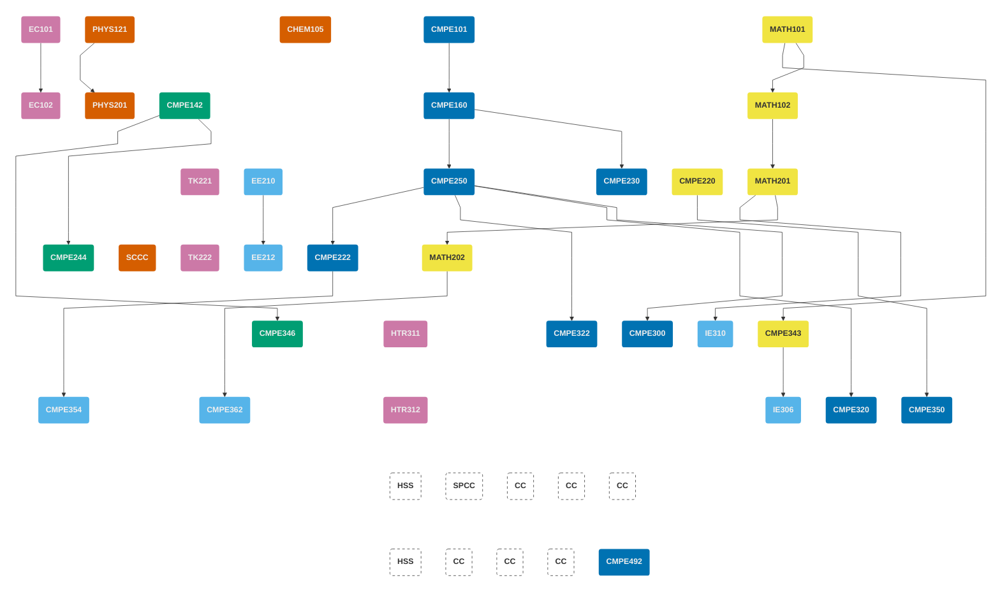

<!-- prettier-ignore-start -->

||
|:-- |:----------- |:-:|:---:|
| <h4>Birinci Dönem</h4>|
| **Ders Kodu** |**Ders Başlığı** | **Önkoşullar** | **Kredi** | **AKTS** |
| MATH101 | Analiz I | --- | 4 | 6 |
| PHYS121 | Mekanik ve Termodinamiğe Giriş | --- | 4 | 6 |
| CHEM105 | Kimyanın Temelleri | --- | 4 | 6 |
| [CMPE101](/tr/courses/cmpe101) | Bilgisayar Mühendisliğine Giriş | --- | 4 | 6 |
| EC101 | Mikroekonominin İlkeleri | --- | 3 | 6 |
| | | **Toplam** | **19** | **30** |
| <h4>İkinci Dönem</h4>|
| **Ders Kodu** |**Ders Başlığı** | **Önkoşullar** | **Kredi** | **AKTS** |
| MATH102 | Analiz II | MATH101 | 4 | 6 |
| PHYS201 | Fizik III | PHYS121 | 4 | 6 |
| [CMPE142](/tr/courses/cmpe142) | Dijital Sistemler | --- | 4 | 6 |
| [CMPE160](/tr/courses/cmpe160) | Nesne Tabanlı Programlamaya Giriş | CMPE101 | 4 | 8 |
| EC102 | Makroekonominin İlkeleri | EC101 | 3 | 6 |
| | | **Toplam** | **19** | **32** |
| <h4>Üçüncü Dönem</h4>|
| **Ders Kodu** |**Ders Başlığı** | **Önkoşullar** | **Kredi** | **AKTS** |
| MATH201 | Matris Kuramı | --- | 4 | 5 |
| EE210 | Elektrik Mühendisliğine Giriş | --- | 3 | 6 |

| [CMPE220](/tr/courses/cmpe220) | Kesikli Hesaplama Yapıları | --- | 3 | 5 |
| [CMPE230](/tr/courses/cmpe230) | Sistem Programlama | CMPE160 | 3 | 6 |
| [CMPE250](/tr/courses/cmpe250) | Veri Yapıları ve Yordamlar | CMPE160 | 3 | 6 |
| TK221 | Türkçe I |  | 2 | 3 |
| | | **Toplam** | **18** | **31** |
| <h4>Dördüncü Dönem</h4>|
| **Ders Kodu** |**Ders Başlığı** | **Önkoşullar** | **Kredi** | **AKTS** |
| MATH202 | Türevsel Denklemler | MATH201 | 4 | 7 |
| PHYS202 / Bilim Seçmeli | Fizik IV / Bilim Seçmeli <a href="#note-sci">(1)</a> | PHYS201 (PHYS202 için) | 3 | 6 |
| EE212 | Elektronik Mühendisliğine Giriş | EE210 | 3 | 4 |
| [CMPE222](/tr/courses/cmpe222) | Veri Tabanı Sistemlerine Giriş | CMPE250 | 3 | 6 |
| [CMPE244](/tr/courses/cmpe244) | Bilgisayar Organizasyonu | CMPE142 | 4 | 5 |
| TK222 | Türkçe II | | 2 | 3 |
| | | **Toplam** | **19** | **31** |
| <h4>Beşinci Dönem</h4>|
| **Ders Kodu** |**Ders Başlığı** | **Önkoşullar** | **Kredi** | **AKTS** |
| [CMPE300](/tr/courses/cmpe300) | Algoritma Analizi | CMPE250 | 3 | 5 |
| [CMPE322](/tr/courses/cmpe322) | İşletim Sistemleri | CMPE250 | 3 | 6 |
| [CMPE343](/tr/courses/cmpe343) | Bilgisayar Mühendisleri için Olasılık ve İstatistiğe Giriş | MATH101 | 3 | 6 |
| [CMPE346](/tr/courses/cmpe346) | Gömülü Sistem Tasarım Temelleri | CMPE142 | 4 | 6 |
| IE310 | Yöneylem Araştırması | MATH201 | 4 | 5 |
| HTR311 | Türkiye Cumhuriyeti Tarihi I |  | 2 | 3 |
| | | **Toplam** | **19** | **31** |
| <h4>Altıncı Dönem</h4>|
| **Ders Kodu** |**Ders Başlığı** | **Önkoşullar** | **Kredi** | **AKTS** |
| [CMPE320](/tr/courses/cmpe320) | Programlama Dillerinin Prensipleri | CMPE250 | 3 | 5 |
| [CMPE350](/tr/courses/cmpe350) | Biçimsel Diller ve Makineler Kuramı | CMPE220 | 3 | 5 |
| [CMPE354](/tr/courses/cmpe354) | Yazılım Mühendisliği | CMPE222 | 4 | 4 |
| [CMPE362](/tr/courses/cmpe362) | Bilgisayar Mühendisleri için Sinyal İşlemeye Giriş | MATH202 | 3 | 6 |
| IE306 | Sistem Benzetimi | CMPE343 | 4 | 7 |
| HTR312 | Türkiye Cumhuriyeti Tarihi II | | 2 | 3 |
| | | **Toplam** | **19** | **30** |
| <h4>Yedinci Dönem</h4>|
| **Ders Kodu** |**Ders Başlığı** | **Önkoşullar** | **Kredi** | **AKTS** |
| Belirtilmiş Serbest Seçmeli <a href="#note-spec">(3)</a>  | Bölüm-Kısıtlı Serbest Seçmeli |  | 3 | 5 |
| HUM101 / HSS <a href="#note-hss">(2)</a>  | Beşeri ve Sosyal Bilimler Dersi (Seçmeli) |  | 4 | 6 |
| CC <a href="#note-cc">(4)| Tamamlayıcı Teknik Ders (Seçmeli)|  | 3 | 6 |
| CC <a href="#note-cc">(4)| Tamamlayıcı Teknik Ders (Seçmeli)|  | 3 | 6 |
| CC  <a href="#note-cc">(4)</a> | Tamamlayıcı Teknik Ders  (Seçmeli) | | 3 | 6 |
| | | **Toplam** | **16** | **29** |
| <h4>Sekizinci Dönem</h4>|
| **Ders Kodu** |**Ders Başlığı** | **Önkoşullar** | **Kredi** | **AKTS** |
| [CMPE492](/tr/courses/cmpe492) | Bilgisayar Mühendisliği Tasarım Projesi | SENIOR | 4 | 8 |
| HUM102 / HSS <a href="#note-hss">(2)</a>  | 	Beşeri ve Sosyal Bilimler Dersi (Seçmeli) | | 3 | 5 |
| CC | Tamamlayıcı Teknik Ders (Seçmeli) | | 3 | 6 |
| CC <a href="#note-cc">(4)</a>  | Tamamlayıcı Teknik Ders  (Seçmeli) | | 3 | 6 |
| CC <a href="#note-cc">(4)</a>  | Tamamlayıcı Teknik Ders  (Seçmeli) |  | 3 | 6 |
| CMPE400 | Mühendislik Stajı | bölüm kuralları | 0 | 10 |
| | | **Toplam** | **16** | **41** |

<!-- prettier-ignore-end -->

<!-- 
<ol class="ps-3 mb-0 small">
  <li id="note-sci" class="mb-2"><strong>Bilim Seçmeli Dersi</strong> Fizik, Kimya, Biyoloji veya Matematik (hesaplamalı olmayan) alanlarında temel bir bilim dersidir.</li>
  <li id="note-hum" class="mb-2"><strong>HUM101–HUM102–HSS</strong> dersleri birbirlerinin yerine alınabilir ve birbirleriyle tekrarlanabilir.</li>
  <li id="note-spec" class="mb-2"><strong>Belirlenmiş Seçmeli</strong> CmpE Bölümü tarafından sınırlandırılmış serbest bir seçmelidir; diğer listelerle örtüşebilir.</li>
  <li id="note-cc" class="mb-2"> <strong>Tamamlayıcı Dersler</strong> Bölüm Seçmeli listesi içinden seçilebilir.</li>
</ol>

Detaylar için <a href="/undergraduate/electives/">seçmeli dersler sayfasına</a> bakabilirsiniz.
 -->

## Önkoşul Çizgesi

## Komisyon Üyeleri


